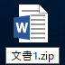
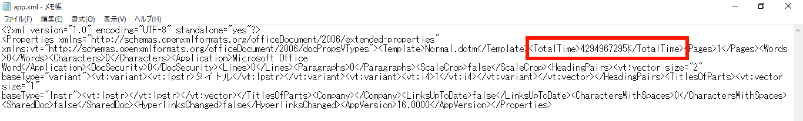

# 目的

Wordの編集時間をイジりたい。

# 方法

1. 空のWordファイルを新規作成し、拡張子を`.zip`に変更する
    
    
    
2. zipを解凍せずに`文書1.zip/docProps/app.xml`をデスクトップにコピーしてメモ帳で開く
 ```
   文書1.zip
  ├── [Content_Types].xml
  ├── _rels
  ├── docProps
  │   ├── app.xml    <----------コレ
  │   └── core.xml
  ├── tmp
  └── word
 ```
3. \<TotalTime\>の部分を好きな数字にして保存する(0〜4294967295の範囲)

   

4. zipファイル内にある`app.xml`を削除し、編集した`app.xml`に置き換える。

5. `文書1.zip`の拡張子を`.docx`に変更してWordで開くと変更が反映されている。
   
   
   # 考察
   
   編集時間の値を4294967295より大きくすると、エラーが出て開けなくなったため編集時間は32bit符号なし整数型で保存されていることが考えられる

